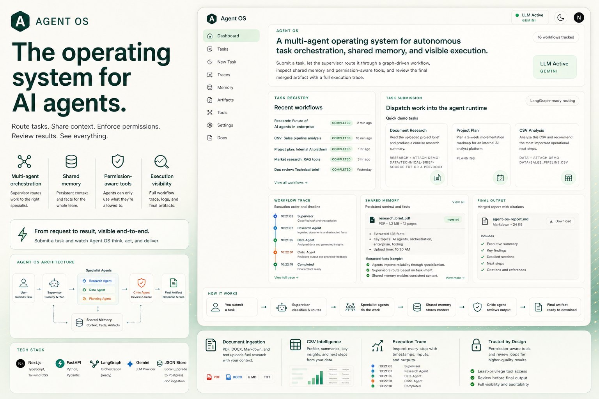
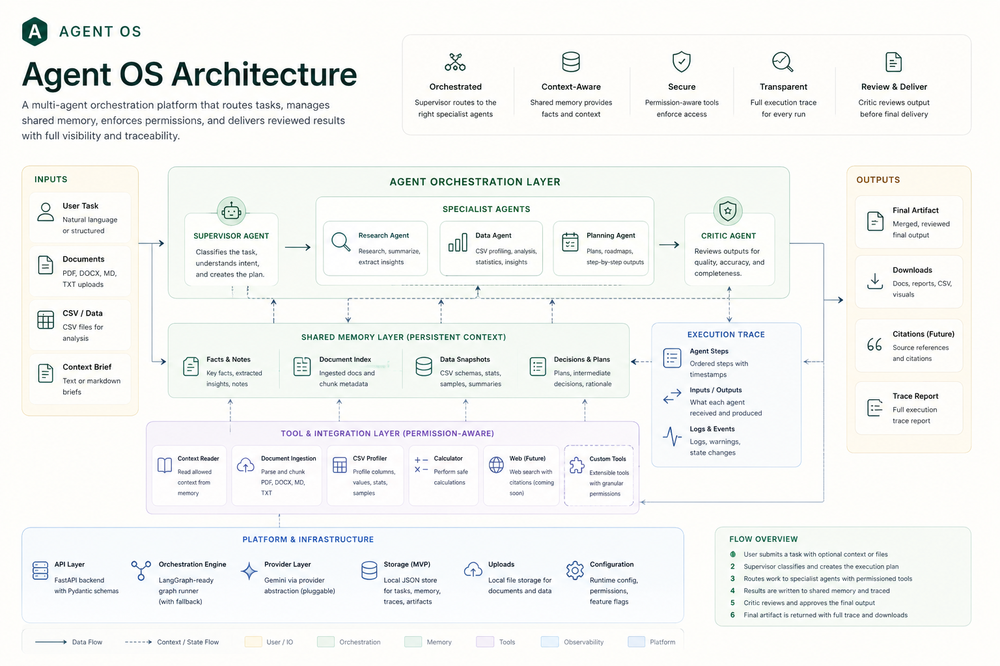

# Agent OS

**A multi-agent orchestration platform that turns AI work into visible, reviewable workflows.**

Agent OS is a full-stack portfolio project that explores what AI products look like beyond a single chatbot. A user submits a task, a supervisor routes it to specialist agents, shared memory carries context across the workflow, permissions control tool access, a critic reviews the result, and the UI shows every step through execution traces.



## Why I Built This

Most AI apps feel like a black box: one prompt goes in, one answer comes out. That is useful, but it does not match how real work happens inside teams.

Real work has routing, roles, context, permissions, review, state, and artifacts. Agent OS is my attempt to model that more honestly: an operating layer for AI agents where the system is inspectable instead of hidden.

## What It Does

- Routes tasks through a supervisor-led multi-agent workflow.
- Supports research, planning, and CSV analysis tasks.
- Ingests research documents from PDF, DOCX, Markdown, and text files.
- Profiles uploaded CSV files and suggests next analytical steps.
- Persists shared memory entries for task summaries, facts, agent outputs, and artifacts.
- Enforces simple role-based permissions before agents use tools.
- Records execution traces with agent names, statuses, timestamps, summaries, and errors.
- Produces final text and JSON artifacts.
- Shows provider status for mock mode vs Gemini-backed execution.

## Core Workflow

```text
User task + optional file
        |
        v
FastAPI task API
        |
        v
Task store + shared memory
        |
        v
Supervisor / orchestrator
        |
        v
Specialist agent
  - Research Agent
  - Planning Agent
  - Data Agent
        |
        v
Critic Agent
        |
        v
Final output + memory + trace + artifacts
        |
        v
Next.js dashboard
```

## Architecture



Agent OS is intentionally modular so new agents, tools, and company-specific pipelines can be added without rewriting the app.

### Backend

- **FastAPI** powers the API layer.
- **Pydantic** defines typed request, response, task, trace, memory, and artifact schemas.
- **Supervisor orchestration** classifies tasks and decides which agents run.
- **LangGraph-ready graph layer** provides a path toward richer branching, retries, and review loops.
- **Agent configs** keep prompts and responsibilities isolated.
- **Tool registry** exposes permission-aware tools to agents.
- **Document ingestion** extracts text from PDF, DOCX, Markdown, and text uploads.
- **Local JSON store** keeps the MVP simple while preserving a clean upgrade path to Postgres.
- **Gemini provider abstraction** allows live model-backed structured outputs when configured.

### Frontend

- **Next.js App Router** for the dashboard.
- **TypeScript** for frontend contracts.
- **Tailwind CSS** for the UI.
- Views for task submission, task registry, workflow trace, shared memory, provider status, and final output.

## Agent Responsibilities

### Supervisor

- Receives the task.
- Infers task type when `auto` is selected.
- Chooses the agent route.
- Manages workflow state.
- Writes memory entries.
- Merges final artifacts.

### Research Agent

- Reads prompt, manual context, and uploaded research documents.
- Extracts findings.
- Produces a structured research summary.
- Works with Gemini when live provider mode is enabled.

### Planning Agent

- Converts a high-level goal into phases, risks, task trees, and next steps.
- Produces project-planning style structured outputs.

### Data Agent

- Reads uploaded CSV files.
- Profiles rows, columns, sample values, numeric ranges, and basic quality risks.
- Suggests operational next steps.

### Critic Agent

- Reviews prior agent output.
- Flags weak, incomplete, or unsupported responses.
- Recommends approval or refinement.

## Permission Model

Permissions are explicit and enforced before tool use:

- `research_agent`: read context, write memory
- `data_agent`: read CSV, write memory
- `planning_agent`: read context, read agent outputs, write memory
- `critic_agent`: read agent outputs, review outputs
- `supervisor`: full coordination access

This keeps the architecture honest: agents do not all get unlimited access by default.

## Tech Stack

- **Frontend:** Next.js, TypeScript, Tailwind CSS
- **Backend:** FastAPI, Python, Pydantic
- **Orchestration:** LangGraph-ready graph runner with fallback
- **LLM provider:** Gemini through a provider abstraction
- **Storage:** local JSON task store
- **Tools:** context reader, CSV profiler, document ingestion
- **Testing:** pytest
- **Dev environment:** Docker Compose

## Project Structure

```text
agent-os/
  backend/
    app/
      agents/
      api/
      core/
      memory/
      models/
      orchestration/
      permissions/
      schemas/
      services/
      state/
      tools/
    tests/
  frontend/
    src/
      app/
      components/
      lib/
      types/
  demo-data/
  docs/
  docker-compose.yml
```

## Demo Flows

### 1. Research Task

Upload a PDF, DOCX, Markdown, or text brief and ask Agent OS to summarize it.

Route:

```text
supervisor -> research_agent -> critic_agent
```

### 2. Planning Task

Ask for a two-week roadmap or implementation plan.

Route:

```text
supervisor -> planning_agent -> critic_agent
```

### 3. Data Task

Upload `demo-data/sales_pipeline.csv` and ask for operational next steps.

Route:

```text
supervisor -> data_agent -> critic_agent
```

## Running Locally

### Docker

```bash
docker compose up --build
```

Frontend:

```text
http://localhost:3000
```

Backend docs:

```text
http://localhost:8000/docs
```

### Direct Local Run

Backend:

```bash
cd backend
python -m venv .venv
source .venv/bin/activate
pip install -r requirements.txt
uvicorn app.main:app --reload
```

Frontend:

```bash
cd frontend
npm install
npm run dev
```

## Gemini Configuration

Create a root `.env` file:

```bash
NEXT_PUBLIC_API_BASE_URL=http://localhost:8000/api
LLM_PROVIDER=gemini
GEMINI_API_KEY=your_key_here
USE_MOCK_AGENTS=false
```

If `USE_MOCK_AGENTS=true`, the app still runs with deterministic fallback behavior.

Provider status is exposed at:

```text
GET /api/system/status
```

## Validation

Backend tests:

```bash
PYTHONPYCACHEPREFIX=/tmp/agent-os-pyc pytest backend/tests -q
```

Current test coverage checks:

- health endpoint
- provider status endpoint
- task creation
- document ingestion

## What Is Mocked

This is a strong MVP, not a production deployment.

- Task storage is local JSON, not Postgres.
- Background execution uses FastAPI background tasks, not a durable queue.
- Research uses uploaded/local context, not live web search yet.
- LangGraph is wired as an orchestration layer, but complex retry and self-replanning loops are future work.
- Authentication and multi-user workspaces are not included yet.

## What I Would Build Next

- Live web research with citations.
- Postgres persistence.
- Queue-backed execution with retries.
- Streaming trace updates in the UI.
- Retrieval over uploaded documents.
- Human approval gates for sensitive tool calls.
- Company-specific agent pipelines.

## How I Would Sell This To A Company

Agent OS is not just a chatbot. It is a foundation for custom AI pipelines.

For a company, each repeated workflow can become a pipeline:

```text
Input -> Supervisor -> Specialist Agents -> Tools/Data -> Review -> Final Output -> Logs
```

Examples:

- Sales operations CSV analyst
- Contract review assistant
- Internal research brief generator
- Support ticket triage workflow
- Product planning assistant
- Compliance document reviewer

The value is that AI work becomes structured, permissioned, inspectable, and repeatable.

## Portfolio Summary

Agent OS demonstrates full-stack AI product engineering: backend architecture, multi-agent system design, typed contracts, document ingestion, permission-aware tools, model provider abstraction, workflow state, execution traces, and a polished dashboard for inspecting AI work.

It is built to show how agentic systems can move from one-off prompt responses toward real workflow infrastructure.
